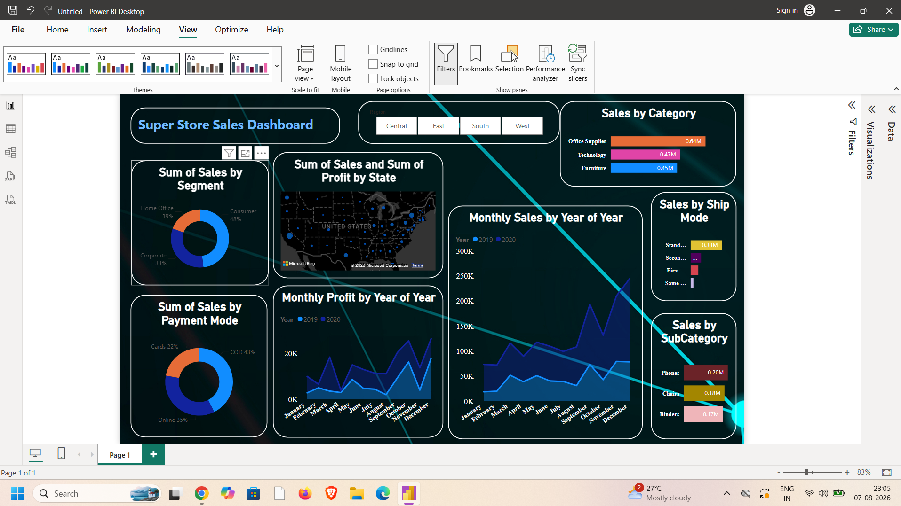
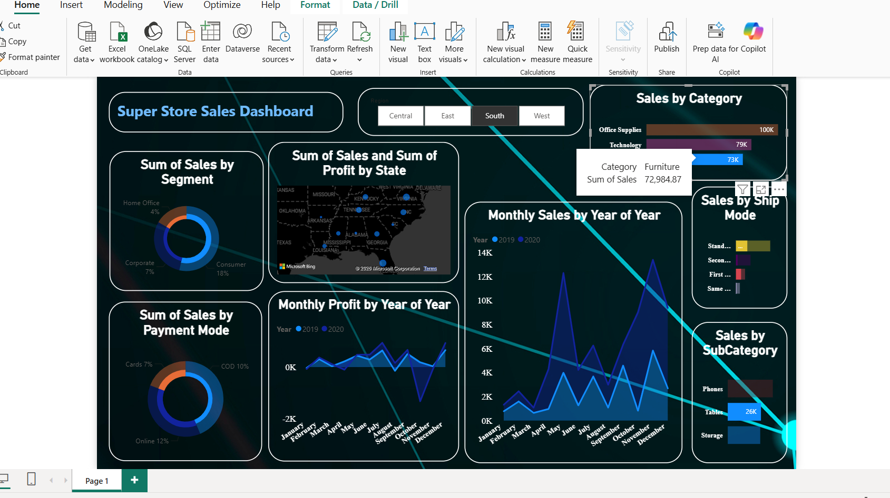
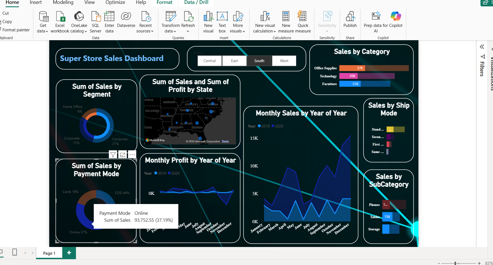
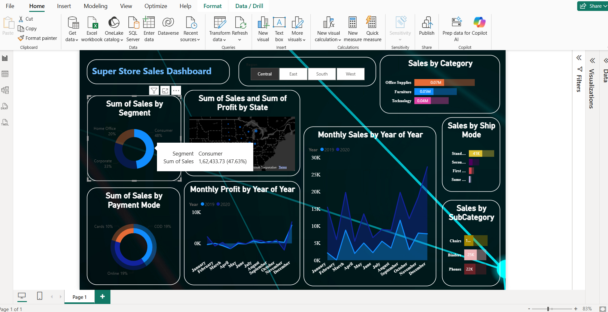

# Super Store Sales Analysis Dashboard 📊

## 📌 Project Overview

This project is an interactive **Power BI dashboard** created to analyze Super Store sales data and generate meaningful business insights.

The dashboard helps understand sales performance, profitability, product categories, customer segments, payment modes, and regional performance through interactive visualizations and KPIs.

## 🎯 Objectives

* Analyze overall sales and profit performance
* Identify top-performing products and categories
* Analyze sales across different regions
* Understand customer segment performance
* Analyze different payment modes
* Track sales and profit trends over time
* Create an interactive and user-friendly Power BI dashboard
* Generate actionable business insights from raw sales data

## 🛠️ Tools & Technologies

* **Power BI**
* **Power Query**
* **Microsoft Excel**
* **DAX**
* **Data Cleaning & Transformation**
* **Data Visualization**

## 🔄 Project Workflow

1. Imported the raw sales dataset into Power BI.
2. Cleaned and transformed the data using **Power Query**.
3. Prepared the data for analysis.
4. Created required calculations and KPIs using **DAX**.
5. Built interactive charts and visualizations.
6. Added filters and slicers for dynamic analysis.
7. Designed the final Power BI dashboard.

## 📊 Dashboard Features

### Key Performance Indicators

* Total Sales
* Total Profit
* Total Orders
* Average Sales

### Sales Analysis

* Sales trends over time
* Category-wise sales
* Sub-category performance
* Product performance
* Sales by payment mode

### Customer Analysis

* Customer segment performance
* Sales by customer segment

### Regional Analysis

* Sales by region
* Regional performance comparison
* Geographical sales insights

## 📸 Dashboard Preview

### Main Dashboard



### Sales by Category



### Sales by Payment Mode



### Sales by Segment



## 💡 Key Insights

The dashboard can be used to identify:

* High-performing product categories
* Profitable and underperforming segments
* Regional sales patterns
* Sales trends over time
* Popular payment modes
* Products contributing significantly to overall revenue
* Areas where business performance can be improved

## 📁 Project Structure

```text
Super-Store-Sales-Analysis/
│
├── images/
│   ├── Dashboard_Overview.png
│   ├── Sales_by_category.png
│   ├── Sales_by_paymentmode.png
│   └── Sales_by_segment.png
│
├── Super Store Sales Analysis.pbix
│
└── README.md
```

## 🚀 How to Use

1. Download the `.pbix` file from this repository.
2. Open the file using **Microsoft Power BI Desktop**.
3. Interact with the dashboard using the available filters and slicers.
4. Explore the visualizations to understand sales, profit, customer, product, and regional performance.

## 🔗 Project Links

* **GitHub Repository:** https://github.com/SkAfnaan1/ecommerce-sales-analysis
* **GitHub Profile:** https://github.com/SkAfnaan1
* **LinkedIn Profile:** https://www.linkedin.com/in/afnaanshaik27/

## 👨‍💻 Author

**Afnaan Shaik**

Aspiring Data Analyst | Power BI | SQL | Python | Excel

### Connect with Me

* 🔗 **GitHub:** https://github.com/SkAfnaan1
* 💼 **LinkedIn:** https://www.linkedin.com/in/afnaanshaik27/

---

⭐ If you find this project useful, feel free to star the repository!
